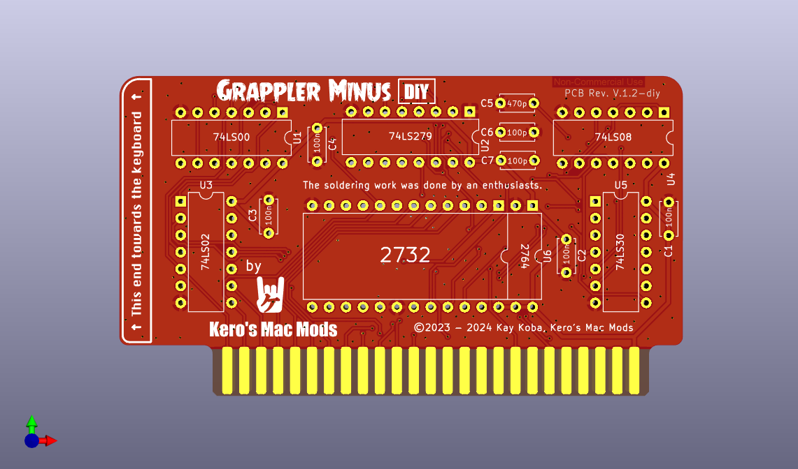

 

   

# GrapplerMinus

I didn't know the structure of Grappler Plus in the early stages, so I turned my attention to Brad Bell 's clone project on the GitHub. I also asked Brad if he would allow me to redesign the Grappler Plus PCB by removing the interface for this purpose. He was kind and allowed it,and fork from his repository.  

My SPIISD worked fine with Grapplerplus on SoftSP, but IIplus would never boot. Also, since Grapplerplus has a useless circuit because it is a printer interface, so they are electrically interfering and delaying Lyle's timing. And by removing these extra circuits, the timing of the 10 smart port redirects may be improved.  

In our testing, SPIISD and GrapplerMinus worked on the Apple IIPlus, which had never worked before! Of course it works like a feather on IIe as well.

## SoftSP DIY 

This card is designed to use "SoftSP DIY" ROM.
SoftSP DIY is a product of Wing Yeung, MFA2 WorkShop(Aka.KbooHK) and used with permission.
http://www.mfa2lab.com

Chris Torrence 's store CT6502 sells SoftSP. I recommend this if you want a complete SoftSP:
https://ct6502.org/product/softsp/

*The copyright and handling of SoftSP DIY is subject to the MFA2 WorkShop license.

## Gerber files

Coming soon

## Assemble

Coming soon

## Supported conputers

Apple IIPlus, Apple IIe
*Apple ///: Possibly bootable if supported onboard ROM.

