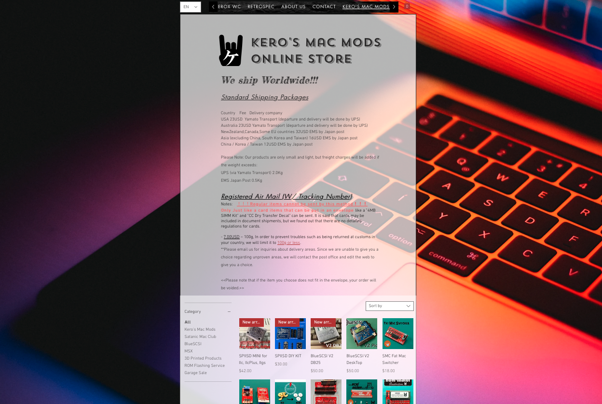

 

   
   

# Grappler Minus

The Grappler Plus was originally a printer interface card, but in recent years no one wanted to use it. However, after Wing Yeung came up with the idea of a repurposed ROM, Grappler Plus' popularity resurfaced. 
Grappler Minus is a clone of Grappler Plus without printer interface functionality. This card does not function on its own. Used in conjunction with Apple's genuine DiskII controller card. It is a card that acts like an interpreter, changing the DiskII controller card to support Smartport like the Liron card.  

The reason for developing this... I didn't know the structure of Grappler Plus in the early stages, so I turned my attention to Brad Bell 's clone project on the GitHub. I also asked Brad if he would allow me to redesign the Grappler Plus PCB by removing the interface for this purpose. He was kind and allowed it, and I forked from his repository.  

   

Our SPIISD worked fine with Grappler Plus on SoftSP DIY V2 and V3, but Apple IIplus would never boot with any ROM Rev. Also, since Grappler Plus has a useless circuit because it is a printer interface, so they are electrically interfering and delaying Lyle's timing. And by removing these extra circuits, the timing of the 10 smart port redirects may be improved.  

In our testing, [SPIISD](https://github.com/kerokero5150/SP2SD_DIY_KIT) and Grappler Minus worked on the Apple IIPlus, which had never worked before! Of course it works like a feather on Apple IIe as well.

### Advantages of Grappler Minus

- Not as difficult to obtain as Grappler Plus, anyone can create it for themselves for free!
- In the last version, all parts have been changed to DIP parts, so soldering is not difficult even for enthusiasts.
- You can try out Smartport without a Liron card. Your investment is minimal.

## SoftSP DIY 

This card is designed to use "SoftSP DIY" ROM.
SoftSP DIY is a product of Wing Yeung, MFA2 WorkShop(Aka.KbooHK) and used with permission.
http://www.mfa2lab.com

  

Latest ROM version is [V6-a](SoftSP-ROMs/softsp-DIY-v6-a.bin), improved timing and different disk slot code can be generated from the utility program.  

Chris Torrence 's store CT6502 sells SoftSP. I recommend this if you want a complete SoftSP:
https://ct6502.org/product/softsp/

## Gerber files

You can use it by compressing this [Gerber](GERBER_GH_DIY) folder and uploading it to JLCPCB as it is.

## Assemble and BOM

### BOM
Location, Parts Number 
U1 74LS00 
U2 74LS279 
U3 74LS02 
U4 74LS08 
U5 74LS30 
U6 EPROM 2732 or 2764 (*SoftSP DIY ROM flashes to this EPROM.) 
C1, C2, C3, C4 100nF multilayer ceramic capacitor 
C5 470pF multilayer ceramic capacitor 
C6, C7 100pF multilayer ceramic capacitor  
Option: 14pin IC socket x4, 16pin IC socket x1, 24pin or 28pin IC socket(wide)  
If you want to use ICs such as 74HCXX that are not CMOS, they will probably work fine, but they are fast but leaky and should be handled with care. Please try at your own risk.

### ROMS

Wing Yeung has created a new V6-a ROM for SoftSP DIY. After we created the Grappler Minus card, he let us try it out right away. The [ROMs](https://github.com/kerokero5150/GrapplerMinus/tree/main/SoftSP-ROMs) that we have confirmed to work are SoftSP DIY ROM V2, V3 and V6-a. 

## Supported computers

Apple IIPlus, Apple IIe
*Apple ///: Possibly bootable if supported onboard ROM.

## Known issues

This is designed to work with our product SPIISD, Please note the following points: 
- It is known that the Grappler Minus card does not work with MFA2 WorkShop's WDrive due to timing issues.   
This issue was solved by Wing Yeung, plx see my [blog](https://ameblo.jp/keroxiee1016/entry-12838344596.html)  
- SoftSP DIY ROM on the Grappler "Plus" printer card, and SPIISD have limited functionality and cannot be used with IIPlus. There is a mutual timing issue. 
- BMOW's FloppyEMU is not structured to block the 5V inflow at pin 12, so it will destroy its CPLD. For safe use, we do not recommend using them together. 

## Available for purchase now
  
You can buy it in [our store](https://en.infinityproducts.co.jp/shop-1). Bare PCB and complete finished product.

## License
Grappler Minus is licensed under [CC BY-NC-SA 4.0](https://creativecommons.org/licenses/by-nc-sa/4.0/). Your personal use is permitted, but not for sale.  
The copyright and handling of "SoftSP DIY" is subject to the [MFA2 WorkShop](http://www.mfa2lab.com) license. used with permission.

## Special Thanks

I would like to express many thanks to the following our friends. They helped with this project:

Wing Yeung, MFA2 WorkShop(Aka.KbooHK) 
Chris Torrence, Assembly Lines 
Bradly Bell (Aka. BTB) 
Petar Puskarich  

